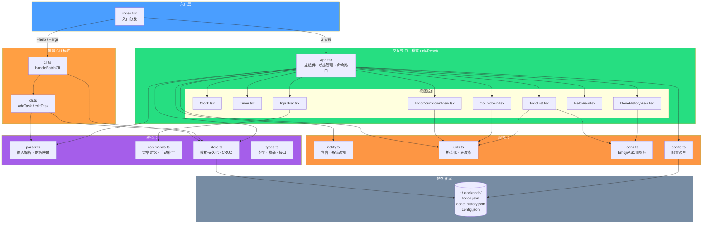
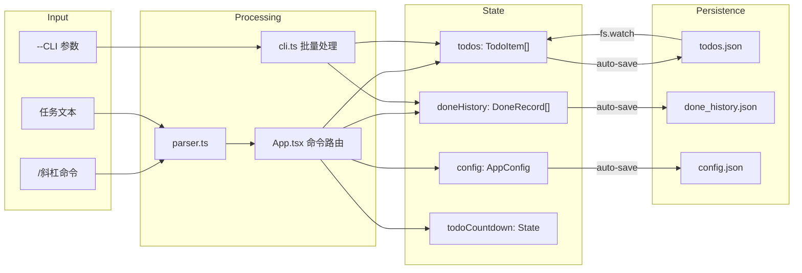
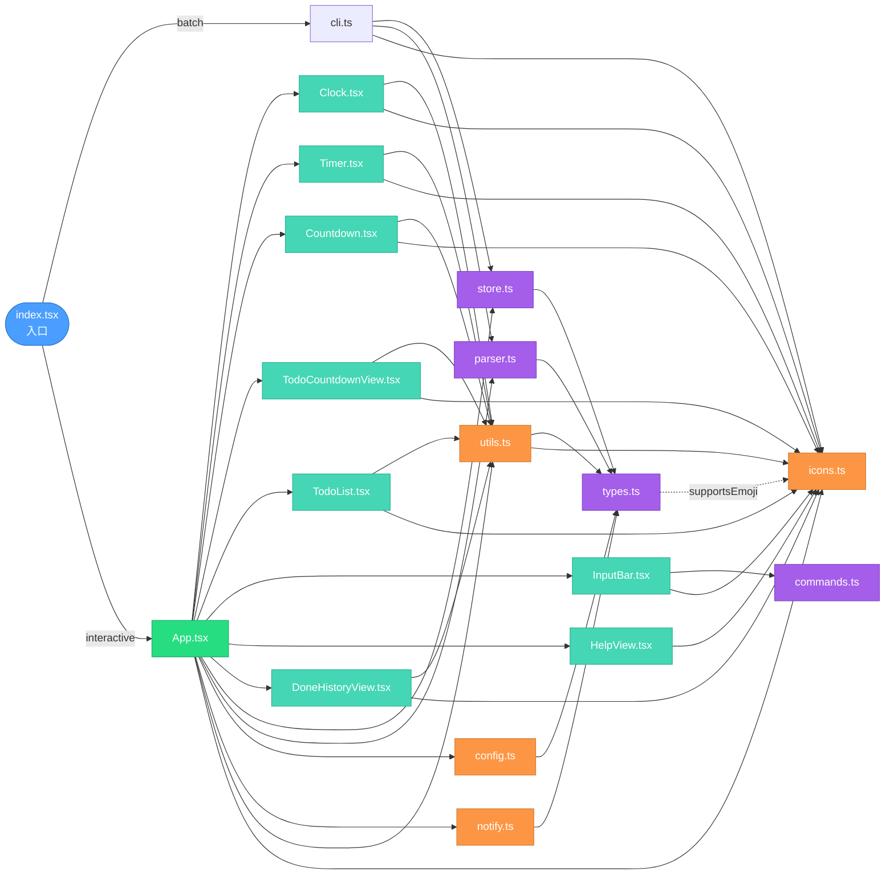
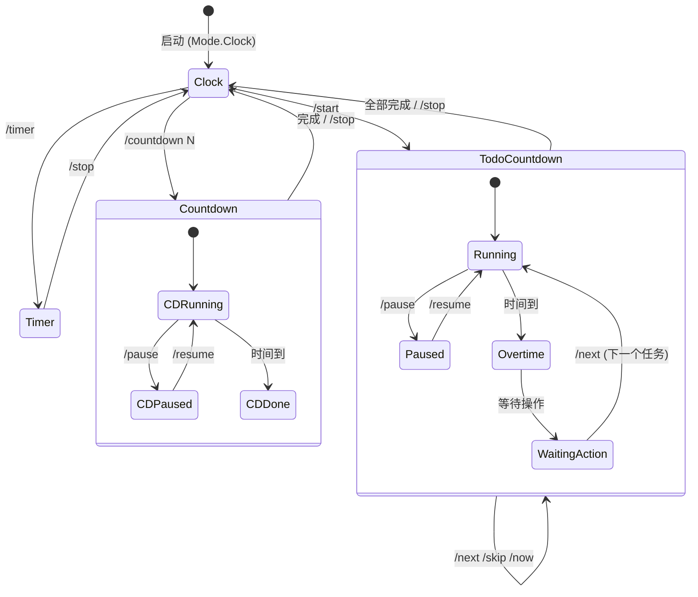
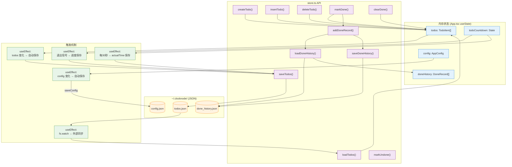
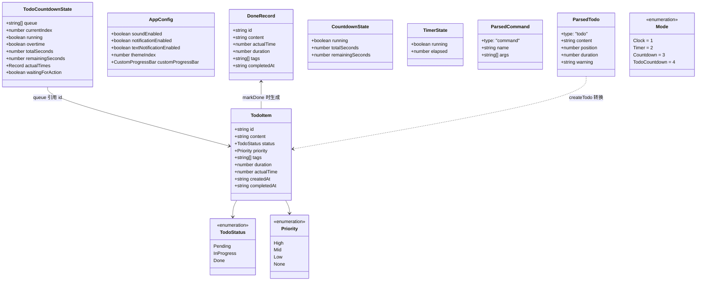
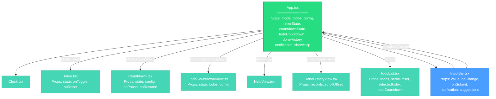

# ClockNode Architecture

> Auto-generated from GitNexus knowledge graph (126 symbols, 288 relationships, 15 execution flows)

## Overview

ClockNode 是一个基于 **Ink/React** 的终端应用，提供时钟、计时器、倒计时和 TODO 任务管理功能。采用 **TypeScript 5.7 + ESM** 模块，支持两种运行模式：

- **交互式 TUI**：基于 Ink 渲染的终端 UI，通过斜杠命令（`/xxx`）操作
- **批量 CLI**：通过命令行参数（`--xxx`）进行非交互式批量操作

数据持久化到 `~/.clocknode/` 目录（JSON 文件）。

## Architecture Diagram



## Functional Areas

知识图谱识别了 **2 个功能社区**：

### 1. Components（40 symbols，71% cohesion）

核心应用逻辑和 UI 组件集群，包含：

| 模块 | 关键符号 | 职责 |
|------|----------|------|
| **App.tsx** | `App`, `onExit`, `onSignal`, `calcActualTime`, `requireConfirm`, `advanceTodoCountdown` | 全局状态、命令路由、生命周期管理 |
| **store.ts** | `loadTodos`, `saveTodos`, `markDone`, `resetAll`, `sortTodos`, `loadDoneHistory`, `deleteDoneRecordRange` | 数据 CRUD 与持久化 |
| **cli.ts** | `handleBatchCli` | 批量命令处理入口 |
| **views** | `TodoList`, `TodoCountdownView`, `DoneHistoryView`, `InputBar` | UI 渲染组件 |
| **utils.ts** | `formatTime`, `renderProgressBar`, `priorityLabel` | 显示格式化 |
| **commands.ts** | `matchCommands` | 命令匹配与自动补全 |

### 2. Task Creation（5 symbols，50% cohesion）

任务创建与输入解析管道：

| 符号 | 文件 | 职责 |
|------|------|------|
| `parseInput` | parser.ts | 解析用户输入为命令或待办 |
| `parseDuration` | parser.ts | 时长字符串解析（预设/分钟/小时） |
| `createTodo` | store.ts | 创建 TodoItem 对象 |
| `insertTodo` | store.ts | 插入到指定位置 |
| `addTask` | cli.ts | CLI 任务添加协调器 |

## Key Execution Flows

知识图谱追踪了 **15 条执行流**，按功能分为 5 大类：

### Flow 1: 批量 CLI 任务添加

```
handleBatchCli (cli.ts)
  → addTask (cli.ts)
    → parseInput (parser.ts)  →  parseDuration (parser.ts)
    → createTodo (store.ts)   →  insertTodo (store.ts)
    → loadTodos (store.ts)    →  ensureDir (store.ts)  →  ~/.clocknode/
```

用户通过 `--add_task "内容 @20m"` 添加任务，经过解析、创建、持久化的完整链路。

### Flow 2: 倒计时任务推进

```
advanceTodoCountdown (App.tsx)
  → addDoneRecord (store.ts)
    → loadDoneHistory (store.ts)
      → ensureDir (store.ts)  →  ~/.clocknode/done_history.json
  → triggerNotification (notify.ts)
    → playSound (notify.ts)            // BEL 声音
    → showSystemNotification (notify.ts) // 系统通知
```

任务完成时，记录到历史并触发声音+系统通知。

### Flow 3: 安全退出与进度保存

```
onExit / onSignal (App.tsx)
  → saveCountdownProgress (App.tsx)
    → saveTodos (store.ts)
      → ensureDir (store.ts)  →  ~/.clocknode/todos.json
```

`beforeExit`、`SIGINT`、`SIGTERM` 信号触发，确保倒计时进度不丢失。

### Flow 4: 通知系统

```
App (App.tsx)  /  advanceTodoCountdown (App.tsx)
  → triggerNotification (notify.ts)
    ├→ playSound (notify.ts)              // BEL 字符到 stderr/stdout
    └→ showSystemNotification (notify.ts)  // node-notifier 动态导入
```

倒计时结束、任务超时等场景同时触发终端铃声和操作系统原生通知。

### Flow 5: 输入自动补全

```
InputBar (InputBar.tsx)
  → getSuggestions (InputBar.tsx)
    → matchCommands (commands.ts)  // 前缀匹配 23 个命令的 name + aliases
```

用户输入 `/` 开头时实时匹配命令，最多显示 6 条建议。

## Data Flow



## Component Rendering Tree

```
App (column layout)
├── Header: "ClockNode | mode | /h for help"
├── ─────── (divider)
├── Clock (always visible, 1s refresh)
├── [Timer | Countdown | TodoCountdownView] (mode-dependent)
├── ─────── (divider)
├── [HelpView | DoneHistoryView | TodoList] (mutually exclusive)
├── ─────── (divider)
└── InputBar (autocomplete + notification)
```

## File Dependency Map

| File | Depends On | Depended By |
|------|-----------|-------------|
| `index.tsx` | App.tsx, cli.ts, types.ts | — (entry) |
| `App.tsx` | store, parser, notify, utils, config, icons, types, all views | index.tsx |
| `cli.ts` | store, parser, utils, icons, types | index.tsx |
| `store.ts` | types | App.tsx, cli.ts |
| `parser.ts` | types, commands | App.tsx, cli.ts |
| `commands.ts` | types | parser.ts, InputBar.tsx |
| `notify.ts` | types | App.tsx |
| `utils.ts` | types, icons | App.tsx, Countdown, TodoCountdownView, TodoList, cli.ts |
| `config.ts` | types | App.tsx |
| `icons.ts` | — | utils.ts, TodoList, DoneHistoryView, cli.ts |
| `types.ts` | — | all files |

## Knowledge Graph（知识图谱）

### 1. 完整模块依赖图



### 2. 执行流程图（15 条 Execution Flows）

```mermaid
flowchart TB
    subgraph F1["Flow 1: 批量 CLI 任务添加"]
        direction LR
        F1A["handleBatchCli"] --> F1B["addTask"]
        F1B --> F1C["parseInput"]
        F1C --> F1D["parseDuration"]
        F1B --> F1E["createTodo"]
        F1E --> F1F["insertTodo"]
        F1F --> F1G["ensureDir"]
        F1G --> F1H[("~/.clocknode/")]
    end

    subgraph F2["Flow 2: 交互式命令处理"]
        direction LR
        F2A["InputBar<br/>onSubmit"] --> F2B["parseInput"]
        F2B --> F2C["App.handleSubmit"]
        F2C --> F2D{"command<br/>or todo?"}
        F2D -->|command| F2E["命令路由<br/>switch(name)"]
        F2D -->|todo| F2F["createTodo<br/>→ insertTodo"]
    end

    subgraph F3["Flow 3: 倒计时任务推进"]
        direction LR
        F3A["advanceTodoCountdown"] --> F3B["addDoneRecord"]
        F3B --> F3C["loadDoneHistory"]
        F3C --> F3D["ensureDir"]
        F3A --> F3E["triggerNotification"]
        F3E --> F3F["playSound"]
        F3E --> F3G["showSystemNotification"]
    end

    subgraph F4["Flow 4: 安全退出"]
        direction LR
        F4A["onExit / onSignal"] --> F4B["saveCountdownProgress"]
        F4B --> F4C["saveTodos"]
        F4C --> F4D["ensureDir"]
        F4D --> F4E[("todos.json")]
    end

    subgraph F5["Flow 5: 输入自动补全"]
        direction LR
        F5A["InputBar"] --> F5B["getSuggestions"]
        F5B --> F5C["matchCommands"]
        F5C --> F5D["COMMANDS[]<br/>23 条命令"]
    end

    style F1 fill:#fff3e0,stroke:#ff9800
    style F2 fill:#e8f5e9,stroke:#4caf50
    style F3 fill:#e3f2fd,stroke:#2196f3
    style F4 fill:#fce4ec,stroke:#e91e63
    style F5 fill:#f3e5f5,stroke:#9c27b0
```



### 3. 状态管理与数据流图



### 4. 数据持久化知识图谱



### 5. 类型关系图（核心数据模型）



### 6. 组件渲染树与 Props 流


